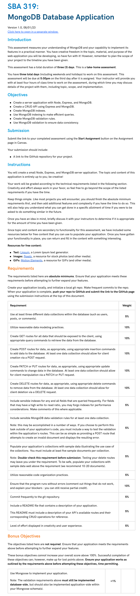

# MongoDB-Database-Application
**Node.js + Express + MongoDB** REST API for managing food recipes, drinks, and reviews.

---

## 📌 API Routes

### **1️⃣ Food Routes (`/foods`)**
| Method | Endpoint | Description |
|--------|----------|-------------|
| **GET** | `/foods` | Get all food items |
| **POST** | `/foods` | Add a new food item |
| **GET** | `/foods/:id` | Get a single food item by ID |
| **PATCH** | `/foods/:id` | Update a food item |
| **DELETE** | `/foods/:id` | Delete a food item |

---

### **2️⃣ User Routes (`/drinks`)**
| Method | Endpoint | Description |
|--------|----------|-------------|
| **GET** | `/drinks` | Get all drinks |
| **POST** | `/drinks` | Add a new drink |

---

### **3️⃣ Review Routes (`/reviews`)**
| Method | Endpoint | Description |
|--------|----------|-------------|
| **GET** | `/reviews` | Get all reviews |
| **POST** | `/reviews` | Add a new review |

---
## 📌 Example Requests
### **1️⃣ Add a Drink Request (`POST /foods`)**
| Action | Instructions |
|--------|-------------|
| **Add a food to the Collection** | When using **Thunder Client**, click **Body → JSON**, then enter:  <br><br> ```json  
{
    "name": "Chicken Alfredo",
    "ingredients": [
        { "name": "Pasta", "amount": "200", "unit": "g" },
        { "name": "Chicken", "amount": "150", "unit": "g" },
        { "name": "Alfredo Sauce", "amount": "1", "unit": "cup" }
    ],
    "instructions": "Boil pasta, cook chicken, mix with Alfredo sauce."
}

### **1️⃣ Add a Drink Request (`POST /reviews`)**
| Action | Instructions |
|--------|-------------|
| **Add a review to the Collection** | When using **Thunder Client**, click **Body → JSON**, then enter:  <br><br> ```json  
{
    "drink": "{id of drink document that was added}",
    "food": "{id of food document that was added}",
    "rating": 5,
    "comment": "This was an amazing dish!"
}

### **1️⃣ Add a Drink Request (`POST /drinks`)**
| Action | Instructions |
|--------|-------------|
| **Add a Drink to the Collection** | When using **Thunder Client**, click **Body → JSON**, then enter:  <br><br> ```json  
{  
    "name": "Mojito",  
    "ingredients": [  
        { "name": "White Rum", "amount": "2 oz" },  
        { "name": "Lime Juice", "amount": "1 oz" },  
        { "name": "Mint Leaves", "amount": "10 leaves" },  
        { "name": "Soda Water", "amount": "2 oz" }  
    ],  
    "instructions": "Muddle mint leaves and lime juice, add rum and soda water. Serve over ice.",  
    "category": "Cocktail",  
    "alcoholContent": true,  
    "glassType": "Highball"  
}  
``` |

|-----------|

# SBA-319
